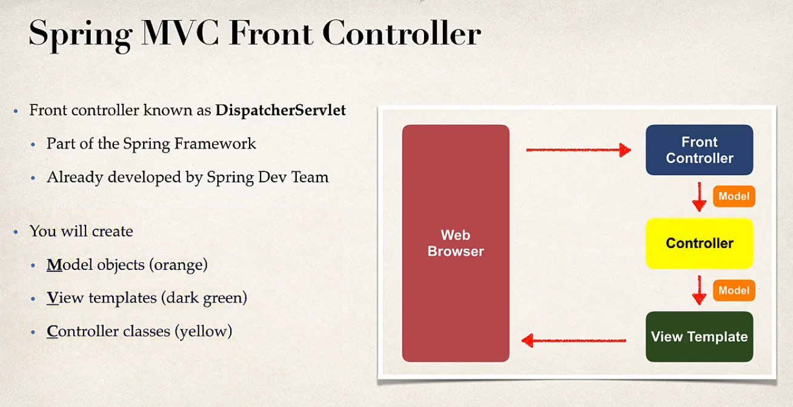

# Overview

Repository to track development and details about Spring MVC

## Notes

1. **Static Resources**
   SprintBoot searches the following directories for static resources all under ```/src/main/resources/``` in given priority: <br>
    - /META-INF/resources
    - /resources
    - /static
    - /public
2. **Components of Spring MVC application**
    - **Web pages**: A set of web pages to layout UI components.
    - **Beans**: A collection of Spring Beans (controllers, services, etc.)
    - **Spring Configuration**: Spring configurations (XML, Annotations or Java class configurations)
3. **Spring MVC flow**
   
    - **Front Controller**: Delegates requests to other objects in our system such as controller functions.
    - **Controller**: Code created by Developer. It contains business logic like:
      - Handles request
      - Store/retrieve data (db, web service)
      - Place data into Model
      - Send flow to appropriate view template
    - **Model**: Contains data which was retrieved and stored in Model object. Data in Model can be any Java object/ Collection.
    - **View Template**: SpringBoot supports different types of view template such as Groovy, Velocity, Freemarker, Thymeleaf etc. 
    which is processed and returned to user.
4. **Parameters to Controller Functions**  
   We can pass the parameter of Model if we want to use model in our controller method.  
   Similarly, we can pass HttpServletRequest parameter to our controller method if we want to get information related to the request.
   ```java
     @Controller
     public class HelloWorldController {
        // ...
        @RequestMapping("/processFormVersionTwo")
        public String letsShoutDude(HttpServletRequest request, Model model){

            String name = request.getParameter("studentName");

            name = name.toUpperCase();

            String message = "Yo! "+name;

            model.addAttribute("message", message);

            return "helloworld";
        }
        // ...
     }
   ```
   The data in the model can be access using ```${modelAttributeName}```  
   ```html
       <!DOCTYPE HTML>
       <html lang="en-US" xmins:th="http://www.thymelead.org"
         xmlns:th="http://www.w3.org/1999/xhtml" xmlns:xmins="http://www.w3.org/1999/xhtml">
           <head>
               <title>Thymeleaf Demo</title>
           </head>
           <body>
               Hello World of Spring!
               <br><br>
               Student name: <span th:text="${param.studentName}"></span>
               <br><br>
               The message: <span th:text="${message}"></span>
           </body>
       </html>
    ```
   *param is value present in Model which contains form data associated to the request*
5. **Binding Request Parameter**  
   Instead of passing ```HttpServletRequest``` object to controller method and then reading parameter from it,  
   we can use ```@RequestParam``` which will extract the parameter with given name and pass it as parameter to our function.  
   ```java
        @Controller
        public class HelloWorldController {
            // ...
            @RequestMapping("/processFormVersionThree")
            public String perocessFormVersionThree(
                @RequestParam(name = "studentName") String name,
                Model model
            ) {
                name = name.toUpperCase();

                String message = "Hey my friend! "+name;

                model.addAttribute("message", message);

                return "helloworld";
            }
            // ...
        }
   ```
6. **@GetMapping and @PostMapping**  
   By default ```@RequestMapping``` handles all type of request like GET, POST etc.  
   To limit the mapping to only use a certain method, we can specify using ```@RequestMapping("URI", method=MethodType.[type])```  
   Instead of specifying attribute in ```@RequestMapping``` , we can use annotations like ```@GetMapping``` and ```@PostMapping```.  
   **GET**: Good for debugging, bookmarking or sending URL, but has limitations on data length  
   **POST**: Can not bookmark or send URL, but has no limitation on data length and can also handle binary data (files, etc.)  
7. **Form Data Binding**  
   We can bind a form data to a JAVA object using this feature. Steps for binding instance to form:  
   - Create an instance of the class, and the controller function should pass this instance to View via the Model.    
   - The form being created in View should mention the object to bind to using ```th:object=${bindingObjectName}``` in ```<form>```.  
   - The fields of form also bind to an attribute in the instance using ```th:field=${bindingObjectName.field}```  
     or ```th:field=*{field}``` in ```<input>```.
   - When the form is submitted and flow passes to another controller function, it can accept the instance of object of 
     Class bond to Form as parameter using ```@ModelAttribute("bindingObjectName") Class object```

   ```java
   @Controller
   public class StudentController {
   
        @GetMapping("/showStudentForm")
        public String showForm(Model model) {
   
           Student student = new Student();
   
           model.addAttribute("bindingStudentObject", student);
   
           return "student-form";
        }
   
        @PostMapping("/processStudentForm")
        public String processForm(@ModelAttribute("bindingStudentObject") Student student) {
   
           System.out.println("Student: "+student.getFirstName()+" "+student.getLastName());
   
           return "student-confirmation";
        }
   
   }
   ```
   ```html
   <!DOCTYPE HTML>
   <html lang="en-US" xmins:th="http://www.thymelead.org" xmlns:xmins="http://www.w3.org/1999/xhtml"
         xmlns:th="http://www.w3.org/1999/xhtml">
       <head>
           <title>Student Registration Form</title>
       </head>
       <body>
           <h3>Student Registration Form</h3>
           <form th:action="@{/processStudentForm}" th:object="${bindingStudentObject}" method="POST">
               First name: <input type="text" th:field="${bindingStudentObject.firstName}" />
   
               <br><br>
   
               Last name: <input type="text" th:field="*{lastName}" />
   
               <br><br>
   
               <input type="submit" value="Submit" />
           </form>
       </body>
   </html>
   ```
